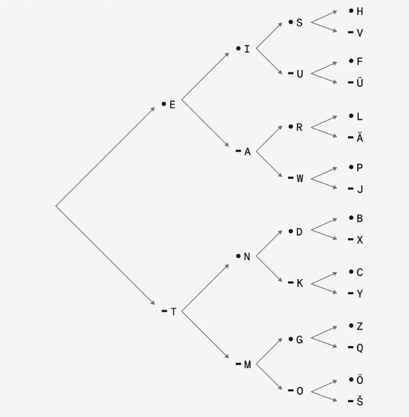

### Chapter 2 부호와 조합

모스 부호를 보낼 때는 단어별로 정렬된 표를 이용하면 되기 때문에 쉽지만, 모스 부호를 수신하고 해석할 때는 전달 받은 점과 선의 조합을 글자로 풀어내야 하므로 보다 어렵고 시간이 소요됩니다. 이 문제를 해결하기 위해, 다음과 같이 모스 부호 조합 개수별로 알파벳으로 변환하는 표를 구분할 수 있습니다.

모스 부호 1개 조합
●|E
-|-
－|T

모스 부호 2개 조합
●●|I|－●|N
-|-|-|-
－|A|－－|M

모스 부호 3개 조합
●●●|S|●●－|U
-|-|-|-
●－●|R|●－－|W
－●●|D|－●－|K
－－●|G|－－－|O

모스 부호 4개 조합

| ●●●●    | H   | ●●●－    | V   |
| ------- | --- | -------- | --- |
| ●●－●   | F   | ●●－－   |
| ●－●●   | L   | ●－●－   |
| ●－－●  | P   | ●－－－  | J   |
| －●●●   | B   | －●●－   | X   |
| －●－●  | C   | －●－－  | Y   |
| －－●●  | Z   | －－●－  | Q   |
| －－－● |     | －－－－ |

모스 부호를 받았을 때 점과 선이 몇개 인지 알아내서 해당 표를 참조하여 문자를 해석할 수 있습니다.

4개의 표에서 각각 2개, 4개, 8개, 16개의 문자를 표현할 수 있습니다. 따라서 모스 부호 4개 이하의 조합으로 영문 알파벳 26자를 모두 표현할 수 있습니다. 이처럼 조합의 갯수가 늘어날 때마다 표현 가능한 경우의 수는 2배씩 증가합니다. 모스 부호처럼 두 가지 신호로 길이가 n인 조합을 만들 경우 표현할 수 있는 부호의 수는 2ⁿ개입니다.

**Morse code binary tree**를 이용해서 좀더 쉽게 모스 부호를 해독할 수 있습니다.

모스 부호를 해독하기 위해 모드 부호 조합 순서대로 왼쪽에서 오른쪽으로 화살표를 따라가면 문자를 찾을 수 있습니다. 이 표를 이용함으로써 같은 코드에 서로 다른 문자를 할당하거나 불필요하게 점과 선의 조합을 만드는 일을 막을 수 있습니다.

모스 부호는 점과 선이라는 두 가지 요소로 이루어져 있으므로 이진 부호라고 부를 수 있습니다. 이진 부호로 표현할 수 있는 갯수는 2의 거듭 제곱으로 표현할 수 있습니다.
