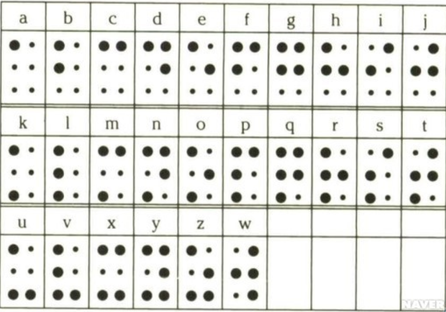
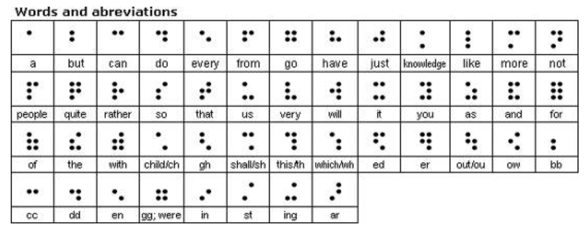

### Chapter 3 점자와 이진 부호

파리에서 활동했던 시각 장애인 루이 브라유(Louis Braille 1809~1852)는 촉각으로 문자를 읽을 수 있도록 평면 위에 볼록 튀어나온 돋움 문자를 사용하는 자신만의 부호를 만들었고, 이 부호 체계는 오늘날 시각 장애인들이 문자를 읽기 위한 방법으로 통용되고 있습니다.

점자에서 표현하는 기호는 2열 3행짜리 한 칸 내에서 기호를 표현할 수 있고, 하나 이상의 볼록한 점으로 부호화 되어있습니다. 각 자리에 1부터 6까지의 숫자가 부여되어 있습니다.

```
1 ● ● 4
2 ○ ● 5
3 ● ● 6
```

점자의 점은 튀어나온 상태`●` 또는 평평한 상태`○`중 하나를 가질 수 있으므로 6개의 점으로 만들 수 있는 최대 조합 개수는 2⁶입니다. 즉, 점자 하나로 최대 64개의 서로 다른 기호를 표현할 수 있습니다. 점자는 단순한 점의 조합으로 구성되어 있어 손가락으로 한 번에 인식할 수 있으며, 빠르고 정확한 읽기가 가능합니다.


예를 들어 you 라는 문구는 이와 같이 표현할 수 있습니다.

```
● ●   ● ○   ● ○
○ ●   ○ ●   ○ ○
● ●   ● ○   ● ●
 y     o     u
```

점자 체계를 확장한 2기 영어 점자 체계라고 불리는 시스템에서는 문자를 덜 사용하고 읽기 속도를 높이기 위해 많은 축약 어구를 사용합니다. 문자마다 공통으로 많이 사용되는 상용어를 표현합니다.


이후, 일부 점자 옹호자들은 점자 밑에 점 한 줄(2개의 점)을 추가한 8점 자(2⁸ = 256) 체계로 확장하여 사용했습니다. 이를 통해 소문자, 대문자, 숫자, 특수 기호에 모두 고유 부호를 할당할 수 있었고, 일부 컴퓨터 응용프로그램에서 사용됩니다.
